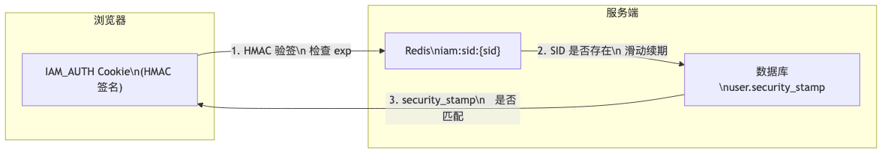
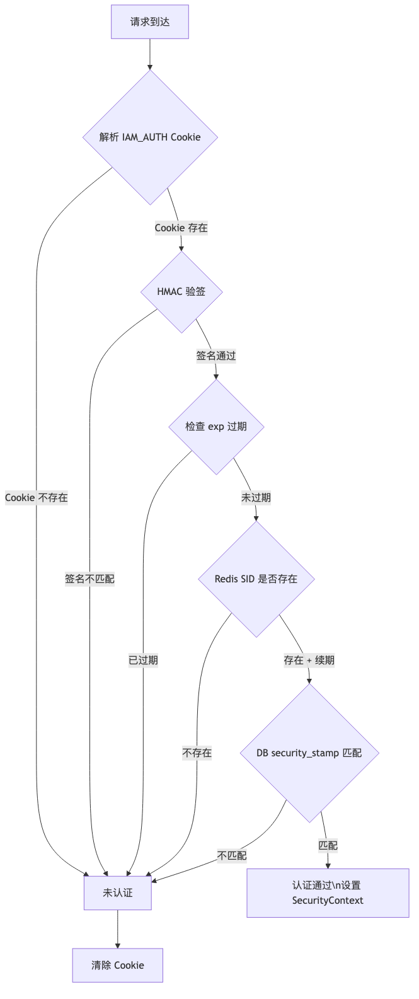
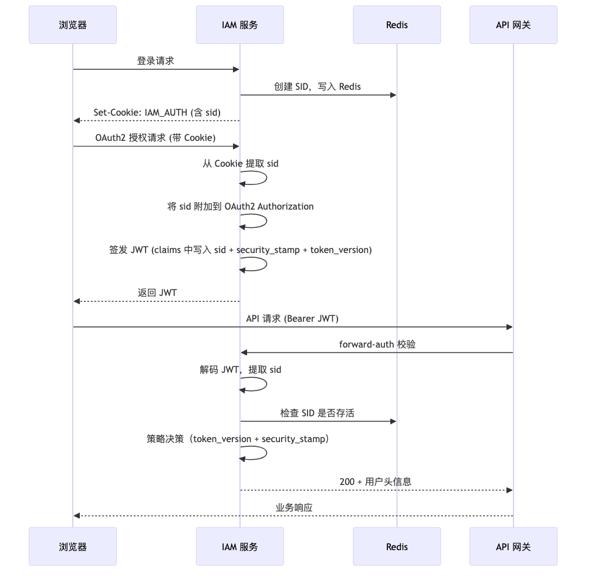
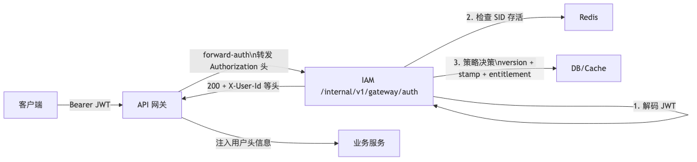

在一套基于 OAuth2/OIDC 的 IAM 系统中，网关用 JWT 做 API 请求的准入控制，这套机制跑通之后，浏览器端的会话管理反而成了一个独立的工程问题：JWT 发出去就收不回来，权限变更无法即时生效，登出操作在前端清了存储但服务端无感。我们最终采用了一个 HMAC 签名 Cookie + Redis SID 的双层结构来管理浏览器会话，它和上层的 JWT 共享同一个 Session ID，实现了浏览器会话和 API 令牌的统一生命周期管理。

<!-- more -->

## JWT 在浏览器端的治理短板

网关对 API 请求做 JWT 校验，这套流程在协议层面没有问题。但当系统需要以下能力时，纯 JWT 就显得不够：

- **即时撤销**：管理员禁用用户后，已签发的 JWT 在过期前仍然有效
- **主动登出**：前端清空了 token 存储，但 JWT 本身不会失效，如果被截获仍可使用
- **权限即时生效**：修改用户角色后，旧 JWT 中携带的权限信息仍然在使用
- **会话追踪**：无法统计当前有多少活跃会话，也无法踢出指定会话

这些问题在 API 网关层面很难解决，因为 JWT 的无状态特性本身就是它的优势。需要额外引入一层有状态的会话管理来补足。

## 为什么不直接用传统 Session

传统服务端 Session 方案可以解决上述问题，但在实际选择时有两个顾虑：

1. **每次请求都查存储**：浏览器端的页面请求频率比 API 请求高得多，每个静态资源请求都触发一次 Session 查询，存储压力和延迟都不理想
2. **与 OAuth2 流程的集成**：系统已经有了完整的 OAuth2 授权码流程和 JWT 签发机制，需要的是一个与现有体系平行的浏览器会话层，而不是替换它

所以设计目标变成了：**在 JWT 体系之外，加一层轻量的浏览器会话管理，既能做到即时撤销，又不给每个请求增加太多开销。**

## 双层架构

整体结构分为两层：



**第一层：HMAC 签名 Cookie**——无状态、防篡改、可独立验证过期。Cookie 中包含用户标识、Session ID、安全戳和过期时间，整段 payload 经过 HMAC-SHA256 签名。

**第二层：Redis SID**——有状态、可撤销、滑动续期。登录时生成随机 Session ID，存入 Redis 并设置 TTL。每次验证通过后重置 TTL，活跃用户不会因超时掉线。

**第三层：DB security_stamp**——账户级安全信号。数据库中每个用户有一个 `security_stamp` 字段，密码修改、账户锁定等安全事件会更新这个值。验证时比对 Cookie 中的 stamp 和数据库中的当前值，不匹配则立即失效。

三层校验中任何一层失败，都会立即清除 Cookie，返回未认证状态。

## Cookie 层的设计

### Cookie 格式

没有使用多个独立 Cookie，而是将所有信息编码到一个 `IAM_AUTH` Cookie 中，格式为：

```
base64url(JSON payload) . base64url(HMAC-SHA256(payload))
```

点号分隔，前半部分是 payload 的 base64url 编码，后半部分是对前半部分的 HMAC-SHA256 签名。这个结构和 JWT 的编码方式类似，但签名算法用对称的 HMAC 而非非对称的 RSA，验证速度更快。

### Payload 内容

```json
{
  "uid": 100,
  "email": "user@example.com",
  "display_name": "张三",
  "sid": "a1b2c3d4e5f6a1b2c3d4e5f6a1b2c3d4",
  "idp": "EMAIL",
  "idp_user_id": null,
  "security_stamp": "abc123def456",
  "exp": 1745577600
}
```

| 字段 | 用途 |
|------|------|
| `uid` | 本地用户 ID |
| `email` | 用户邮箱 |
| `display_name` | 显示名称 |
| `sid` | Session ID，关联 Redis 中的会话记录 |
| `idp` | 身份提供商标识（EMAIL / AAD） |
| `idp_user_id` | 外部 IdP 的用户标识（联合登录时使用） |
| `security_stamp` | 安全戳，与数据库中的当前值比对 |
| `exp` | 过期时间（epoch seconds），默认 12 小时 |

把 `security_stamp` 放在 Cookie 中是一个关键设计：它让每次请求的校验不只需要验证签名，还要确认账户的安全状态没有发生变化。

### 签名与验签

```java
// 签发
Mac mac = Mac.getInstance("HmacSHA256");
mac.init(new SecretKeySpec(secretBytes, "HmacSHA256"));
byte[] signature = mac.doFinal(payload.getBytes(UTF_8));
String cookieValue = base64url(payload) + "." + base64url(signature);

// 验签
byte[] expected = mac.doFinal(receivedPayload.getBytes(UTF_8));
byte[] actual = base64urlDecode(receivedSignature);
if (!MessageDigest.isEqual(expected, actual)) {
    return null;  // 签名不匹配
}
```

签名比对用的是 `MessageDigest.isEqual()` 而不是 `Arrays.equals()`，前者是常量时间比较，可以防止时序攻击（timing attack）。通过观察比较耗时来逐字节猜测签名内容，这是一个容易忽略的攻击面。

### Cookie 属性

```java
ResponseCookie.from("IAM_AUTH", value)
    .httpOnly(true)
    .secure(request.isSecure())
    .sameSite("Lax")
    .path("/")
    .maxAge(Duration.ofSeconds(43200))
    .build();
```

- `HttpOnly`：JavaScript 无法读取，降低 XSS 窃取风险
- `Secure`：仅通过 HTTPS 传输。注意这里用 `request.isSecure()` 动态判断，因为服务部署在 TLS 终止代理之后，需要从 `X-Forwarded-Proto` 头重写 `isSecure()` 的返回值，这个重写由一个高优先级的 Filter 完成
- `SameSite=Lax`：允许顶级导航携带 Cookie，但阻止跨站 POST 请求携带，在安全性和可用性之间取平衡

## Redis SID 层的设计

### Session ID 生成

```java
byte[] bytes = new byte[16];
new SecureRandom().nextBytes(bytes);
String sid = HexFormat.of().formatHex(bytes);  // 32 字符的 hex 字符串
```

16 字节随机数提供 128 bit 的熵，在不考虑密钥空间限制的前提下，碰撞概率可以忽略。

### Redis 存储

Redis 中的存储非常精简，只存 uid 一个字段：

```
Key:   iam:sid:{sid}
Value: {"uid": 100}
TTL:   43200 秒（12 小时）
```

这里有一个有意思的取舍：Session 的完整上下文（用户信息、权限、角色）并没有存在 Redis 中，而是分散在 Cookie（用户基本信息）和数据库（权限、安全戳）中。Redis SID 层的唯一职责是**标记这个 Session 是否仍然有效**，以及**滑动续期**。

不做"胖 Session"的原因：

- 权限数据量大（可能有上百条授权记录），序列化到 Redis 的开销和维护复杂度都不低
- 权限变更时只需要更新数据库中的一个版本号，不需要同步更新所有 Session
- Cookie 已经携带了用户基本信息，Redis 不需要重复存储

### 滑动续期

```java
public boolean isSidActive(String sid) {
    Boolean exists = redisTemplate.hasKey(redisKey(sid));
    if (Boolean.TRUE.equals(exists)) {
        redisTemplate.expire(redisKey(sid), sidTtlSeconds, TimeUnit.SECONDS);
        return true;
    }
    return false;
}
```

每次验证 SID 存活时，同时重置 TTL。这意味着活跃用户永远不会因超时而掉线（前提是 Cookie 的 `exp` 还没到期）。

这里存在双过期机制：

- Cookie 内嵌的 `exp` 是硬性上限（12 小时），签名后不可更改
- Redis SID 的 TTL 是弹性窗口，每次验证都重置

所以实际效果是：**一个会话最长存活 12 小时（由 Cookie `exp` 控制），在这 12 小时内，只要用户持续访问，会话就一直有效。**

## 三层校验流程

浏览器发送的每个请求，都会经过三层校验：



对应的代码实现：

```java
public AuthCookieClaims resolveActiveClaims(HttpServletRequest request,
                                             HttpServletResponse response) {
    // 第 1 层：解析 Cookie + HMAC 验签 + 检查 exp
    AuthCookieClaims claims = resolveClaims(request);
    if (claims == null || claims.sid() == null || claims.securityStamp() == null) {
        return null;
    }

    // 第 2 层：Redis SID 存活检查 + 滑动续期
    if (sidSessionService.isSidActive(claims.sid())) {
        // 第 3 层：DB 用户状态 + security_stamp 匹配
        User user = userMapper.selectActiveByPrimaryKey(claims.userId());
        if (user != null && claims.securityStamp().equals(user.getSecurityStamp())) {
            return claims;
        }
    }

    // 任何一层失败，立即清除 Cookie
    clearAuthenticationCookie(request, response);
    return null;
}
```

三层校验各有侧重：

| 层级 | 检查内容 | 防御的威胁 |
|------|---------|-----------|
| HMAC 签名 | Cookie 是否被篡改 | 伪造、修改 SID 或 exp |
| Redis SID | Session 是否仍然有效 | 登出、被踢、会话过期 |
| DB security_stamp | 账户安全状态是否变化 | 密码修改、账户被禁用 |

任何一层失败都走 fail-closed：清除 Cookie，拒绝请求。没有"降级跳过"的逻辑。

## SID 的生命周期传播

这个方案的一个核心设计是：**浏览器端的 Session ID 不是独立的，它会传播到 JWT 中，形成浏览器会话和 API 令牌的统一生命周期。**



传播过程涉及三个组件的协作：

**1. 登录时创建 SID**

无论通过密码登录还是联合登录，登录成功后统一创建 SID 并写入 Cookie：

```java
// LoginSuccessHandler
String sid = sidSessionService.createAndActivateSid(userId);
authCookieService.writeAuthenticationCookie(request, response, authentication, sid, userId);
```

**2. SID 流入 OAuth2 授权**

当浏览器带着 Cookie 发起 OAuth2 授权请求时，一个装饰器从 Cookie 中提取 SID 并附加到 OAuth2 Authorization 对象上：

```java
// SidAwareOAuth2AuthorizationService
public void save(OAuth2Authorization authorization) {
    String sid = authorization.getAttribute("sid");
    if (sid == null) {
        sid = authCookieService.resolveSidFromCurrentRequest();
        authorization = OAuth2Authorization.from(authorization)
                .attribute("sid", sid)
                .build();
    }
    delegate.save(authorization);
}
```

**3. SID 写入 JWT**

Token 签发时，从 OAuth2 Authorization 中取出 SID，和其他 IAM claims 一起写入 JWT：

```java
// CustomOAuth2TokenCustomizer
String sid = context.getAuthorization().getAttribute("sid");
context.getClaims().claim("sid", sid);
context.getClaims().claim("security_stamp", user.getSecurityStamp());
// 仅 access token 中写入 token_version
if (isAccessToken) {
    context.getClaims().claim("token_version", user.getPermissionVersion());
}
```

这样，JWT 中的 SID 和浏览器 Cookie 中的 SID 是同一个值。删除 Redis 中的这个 SID，浏览器会话和所有通过这个会话签发的 JWT 都会同时失效。

## 双撤销信号

系统中有两个独立的撤销信号，职责不同：

### security_stamp：账户级安全事件

`security_stamp` 存储在用户表的 `security_stamp` 字段中，在以下场景会更新：

- 用户修改密码
- 管理员重置用户密码
- 账户被锁定或解锁
- 其他需要强制所有会话失效的安全事件

校验时，Cookie 中的 `security_stamp` 和 JWT 中的 `security_stamp` 都会和数据库当前值比对。不匹配则立即拒绝。

这个机制的效果是：**修改密码后，该用户的所有浏览器会话和所有 API 令牌都会立即失效。** 不需要逐个撤销 token，也不需要等 JWT 自然过期。

### token_version：权限变更

`permission_version` 是用户表中的一个单调递增版本号，每次权限变更（角色调整、授权增删）时 +1。它只写入 JWT 的 access token（不写入 ID token），在网关鉴权时比对：

```java
// PolicyDecisionService
if (!policy.getPermissionVersion().equals(tokenVersion)) {
    return DecisionResult.denied(TOKEN_VERSION_MISMATCH, ...);
}
```

权限变更后，旧 JWT 的 `token_version` 和数据库中的当前值不一致，请求被拒绝。客户端需要重新走授权流程获取新的 JWT。

### 两者的区别

| 维度 | security_stamp | token_version |
|------|---------------|---------------|
| 触发场景 | 密码修改、账户锁定等安全事件 | 角色调整、授权增删等权限变更 |
| 影响范围 | Cookie + JWT 同时失效 | 仅 JWT 失效 |
| 校验位置 | Cookie 验证 + 网关鉴权 | 仅网关鉴权 |
| 更新频率 | 低（安全事件触发） | 中（权限变更触发） |
| 存储位置 | Cookie payload + JWT claims | 仅 JWT access token claims |

分开两个信号的原因是权限变更比安全事件频繁得多。如果只用一个字段，每次改权限都会强制用户重新登录，体验上不合适。拆开后，改权限只需要重新获取 JWT（前端可以自动完成），改密码才需要重新走登录流程。

## 网关鉴权流程

API 请求通过网关的 `forward-auth` 机制走另一条校验路径：



网关鉴权支持两种模式：

- **entitled 模式**（默认）：完整的 RBAC 检查，包括用户状态、token_version、security_stamp、应用授权
- **authenticated 模式**：只检查用户状态、token_version 和 security_stamp，不做应用授权判断。适用于只需要确认"这个请求是谁发的"的场景

两种模式的区别在于是否做 entitlement 检查，SID 校验和双信号校验都是必经之路。

## 策略缓存与降级

`PolicyDecisionService` 在策略数据上采用了 Redis Primary + DB Fallback 的模式：

```java
private UserPolicy getUserPolicy(Long uid) {
    // 优先从 Redis 读
    try {
        UserPolicy cached = (UserPolicy) redisTemplate.opsForValue().get(cacheKey);
        if (cached != null) return cached;
    } catch (Exception e) {
        log.warn("Redis unavailable, fallback to DB");
    }

    // 降级到 DB
    User user = userMapper.selectActiveByPrimaryKey(uid);
    if (user != null) {
        UserPolicy policy = UserPolicy.from(user, loadSystemRoleCodes(uid));
        // 尝试回填 Redis
        try { redisTemplate.opsForValue().set(cacheKey, policy, 300, SECONDS); }
        catch (Exception ex) { log.warn("Failed to refill cache"); }
        return policy;
    }

    return null;  // DB 也不可用
}
```

如果 Redis 和 DB 都不可用，`getUserPolicy` 返回 null，决策结果是 `POLICY_SERVICE_UNAVAILABLE_FAIL_CLOSE`——拒绝请求。这是一个明确的安全优先于可用性的选择。

权限变更时，管理端会主动删除 Redis 缓存：

```java
public void invalidateCache(Long uid) {
    redisTemplate.delete(cacheKey);
}
```

下一次请求触发缓存未命中，从 DB 重新加载，新的权限数据立即生效。缓存的 TTL 是 300 秒，即使不主动删除，权限变更最多延迟 5 分钟也会生效。

## 登出流程

登出操作同时清理两层：

```java
// SidLogoutHandler
public void logout(HttpServletRequest request, HttpServletResponse response,
                   Authentication authentication) {
    String sid = authCookieService.resolveSid(request);
    sidSessionService.invalidateSid(sid);           // 删除 Redis SID
    authCookieService.clearAuthenticationCookie(request, response);  // 清除 Cookie
}
```

Redis SID 删除后：

- 浏览器后续请求：Cookie 验签能过，但 Redis SID 检查失败，走 fail-closed
- 已签发的 JWT：网关鉴权时 SID 检查失败，请求被拒绝
- 不需要维护黑名单，不需要等 JWT 过期

## 得失分析

### 收益

**即时撤销能力**：删除一个 Redis Key，对应的浏览器会话和所有 API 令牌同时失效。不需要维护 token 黑名单。

**双信号分层**：安全事件（密码修改）强制重新登录，权限变更只要求重新获取 JWT。两者频率和影响范围不同，分开处理更合理。

**与 OAuth2 体系自然集成**：SID 从浏览器 Cookie 流入 OAuth2 授权对象再流入 JWT，不需要额外的令牌管理机制。

**滑动会话**：活跃用户不会超时掉线，但会话有硬性上限（Cookie `exp`）。

### 代价

**Redis 依赖**：Redis 挂了等于所有人登出。这不是世界末日，但会影响体验。缓解措施是 Redis Sentinel/Cluster 高可用部署。设计上没有做"HMAC 降级"——Redis 不可用时直接 fail-closed 而不是跳过 SID 检查，这是安全优先的选择。

**请求路径上的额外开销**：浏览器请求多一次 Redis `hasKey` + `expire`（约 0.1ms 本地 Redis）。API 请求通过网关鉴权，同样多一次 SID 检查。

**实现复杂度**：比纯 JWT 多了 Cookie 签名验签、Redis SID 管理、security_stamp 比对、SID 传播链路、策略缓存降级等逻辑。核心代码约 500-600 行，换来的是即时撤销和统一生命周期管理。

### 适用场景判断

| 场景 | 是否适合 |
|------|---------|
| 内部系统，需要即时撤销和踢人 | 适合 |
| 权限变更需要即时生效 | 适合 |
| 需要统一登出（浏览器 + API 同时失效） | 适合 |
| 纯公开 API，无会话概念 | 不适合，用 JWT 更简单 |
| 跨顶级域名 SSO | 不适合，Cookie 方案受限，需要协议级方案（SAML/OIDC） |
| 超大规模（百万级并发） | 不适合，Redis 单点会成为瓶颈 |

## 延伸阅读

- [OAuth2/OIDC 会话超时的边界：前端 Token、Refresh Token 与 SSO Session](/2026/03/17/oauth2-oidc-session-timeout-boundaries/)
- [联合登录之外：IAM 认证路径的韧性设计](/2026/04/18/why-local-auth-alongside-federation/)
- [RFC 9121: Use of the HMAC Algorithm in JSON Object Signing and Encryption (JOSE)](https://datatracker.ietf.org/doc/html/rfc9121)
- [RFC 7616: HTTP Digest Access Authentication](https://datatracker.ietf.org/doc/html/rfc7616)
