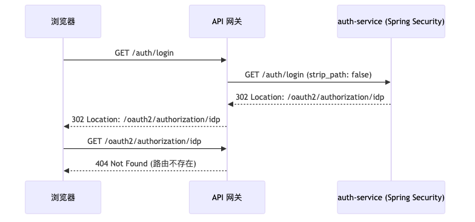
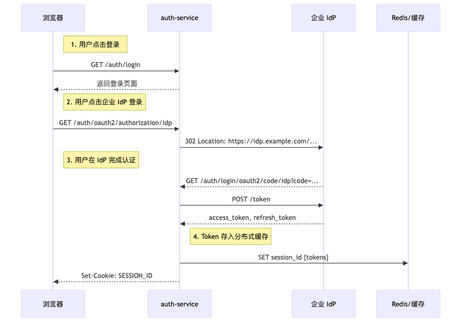
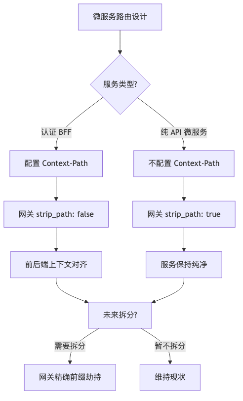

在微服务架构里，API 网关作为流量入口，路由设计直接影响系统的可维护性。分享一次在网关与 Spring Security OAuth2 集成过程中遇到的重定向问题，以及服务拆分场景下通过 Context-Path 配置和 BFF 模式实现平滑演进的经验。

<!-- more -->

## 问题的产生

本地环境调试网关时，通过网关访问示例应用（`http://localhost:18000/java-example`），点击"使用企业 IdP 登录"后跳转到网关的 `/login` 路径，出现了 404。

**当时的"打补丁"方案：**

在网关配置里硬编码了一堆分散路由：

```yaml
routes:
  - paths: ["/login"]
    service: auth-service
  - paths: ["/oauth2"]
    service: auth-service
  - paths: ["/css", "/js", "/error"]
    service: auth-service
```

登录流程跑通了，但这堆散乱的路由配置在网关根目录下显得脆弱。实际运维中会带来：维护成本高、配置混乱、权限控制困难、扩展性差等问题。

## 统一前缀的坑

既然分散路由太乱，能否在网关层面把 `/login`、`/oauth2` 统一套上 `/auth` 前缀转发？

**答案是否定的，这会引发重定向问题。**

Spring Security 在生成 302 跳转的 `Location` 响应头时，如果不知道自己躲在网关的 `/auth` 前缀后面，生成的链接依然基于根路径 `/oauth2/authorization/...`。

流程大概是：
1. 浏览器请求 `/auth/login`
2. 网关转发到 auth-service
3. auth-service 返回 302，Location 头是 `/oauth2/authorization/idp`
4. 浏览器跟着这个绝对路径请求 `/oauth2/authorization/idp`
5. 网关没有这条路由，返回 404



**结论**：前后端上下文必须对齐，不能一边藏头一边露尾。

## Context-Path 的正确打开方式

给 Java 服务加上 Context-Path 配置：

```yaml
server:
  servlet:
    context-path: /auth
```

这样服务自己就知道对外暴露的基路径是 `/auth`，生成的重定向链接自然带上前缀。

但这里有个问题：如果在代码层写死了服务前缀，未来服务需要拆分，客户端的 API URL 是不是得跟着变？

## 网关的防腐层价值

微服务内部不应该关心自己对外的名字。对外公布的 API 契约（如 `http://网关/auth/users`）属于 API 网关的治理资产。

如果拆分了部分接口到新服务，客户端无需改动，仍旧访问旧的 `/auth/new-feature`。

**具体做法**：在网关中增加一条高优先级的精确前缀劫持路由。

```yaml
routes:
  # 通用路由（优先级低）
  - name: route-iam
    service: auth-service
    paths:
      - /auth
    strip_path: false  # 保留 /auth 前缀

  # 精确劫持路由（优先级高）
  - name: route-new-feature
    service: new-service
    paths:
      - /auth/new-feature
    strip_path: true   # 修剪 /auth/new-feature 前缀
```

更具体的路径（`/auth/new-feature`）会被优先匹配，转发到新服务时去掉前缀，客户端代码无需修改。

## BFF 模式与 OAuth2 安全

**BFF（Backend For Frontend）** 模式介于后端服务和前端之间，负责聚合数据、处理特定于前端的逻辑。

**为什么不把登录页分离成纯前端？**

纯浏览器端完成 OAuth2 闭环获取 Token 存在安全风险：
- **隐式流（Implicit Flow）**：直接在浏览器中获取 Access Token，易被 XSS 攻击，已被 OAuth 2.1 废弃
- **PKCE**：是对授权码流的增强，但 Token 的存储和使用仍需在后端完成

**当前最佳实践**：OAuth2 授权码交换必须由后端完成，前端不应持有 Token。

具体流程：
1. 浏览器请求 `/auth/login`，BFF 返回登录页
2. 用户点击企业 IdP 登录，BFF 返回 302 跳转到 IdP
3. 用户在 IdP 完成认证，IdP 回调到 BFF 的 `/auth/login/oauth2/code/idp`
4. BFF 用授权码换取 access_token 和 refresh_token
5. Token 存入 Redis 等分布式缓存，给浏览器设置 HttpOnly + Secure Cookie



关键点：
- Cookie 不能被 JS 读取，防止 XSS 窃取
- 使用分布式缓存共享 Session，避免多实例部署时的 Session 不一致

## 哪些服务需要 Context-Path？

| 服务类型 | 是否需要 Context-Path | strip_path | 原因 |
| :--- | :--- | :--- | :--- |
| **认证 BFF** | 是 | false | 需要处理重定向，前后端上下文必须对齐 |
| **纯 API 微服务** | 否 | true | 无重定向逻辑，网关负责路径修剪，服务保持纯净 |

针对没有重定向逻辑的纯净接口微服务，直接在根路径 `/` 开发，路径组装和修剪在网关层完成。

## 配置示例

**auth-service 的 application.yml：**

```yaml
server:
  servlet:
    context-path: /auth
```

**网关配置：**

```yaml
routes:
  - name: route-iam
    service: auth-service
    paths:
      - /auth
    strip_path: false
```

**客户端访问：**

```
http://网关:18000/auth/login
```

清理掉之前分散的 `/login`、`/oauth2` 等路由配置，只保留这一条。

## 决策参考



## 最后

这次实践的核心收获：找准网关控制面和后台逻辑面的界限，让网关成为真正的防腐层。

- 有重定向的服务必须配置 Context-Path，网关不修剪前缀
- 服务内部不关心对外名字，API 契约由网关治理
- 通过网关精确前缀劫持，服务拆分对客户端无感知
- OAuth2 授权码交换在后端完成，前端不直接持有 Token
