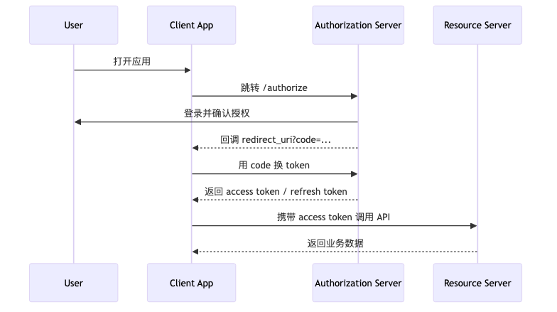

在排查会话超时问题时，遇到过这样一个现象：前端已经提示会话失效，但用户重新进入授权流程后，并没有再次看到登录页，而是直接回到了系统。前后端最开始对这个现象的解释完全对不上，后来把链路拆开看，才发现问题不在某一个配置值，而在于大家说的"登录态"本来就不是同一层东西。

<!-- more -->

## 背景说明

OAuth2/OIDC 里的"登录态"通常不是一个时间，而是几类时间共同作用：

- `authorization code` 决定授权码多久失效
- `access token` 决定当前令牌还能调用 API 多久
- `refresh token` 决定应用还能静默续期多久
- SSO 浏览器会话决定再次进入授权流程时是否还需要输入密码
- 服务端会话标识决定已签发令牌能否被主动撤销

排障时，把这几层拆开看，比只围绕某一个 TTL 反复讨论更有效。

## 常见问题现象

当时看到的现象很具体：

1. 用户正在使用前端应用
2. 一段时间后，前端提示会话过期
3. 用户点击重新登录
4. 浏览器跳转到授权服务器后，没有出现登录页
5. 授权完成后，用户又直接回到了系统

这个现象通常说明两件事同时成立：

- 前端本地持有的 `access token` 已经过期，或者已经被前端判定为即将过期
- 授权服务器的浏览器会话仍然有效，所以授权服务器还认得这个用户

所以，应用提示的"需要重新登录"，很多时候只是"需要重新获取一组 token"，并不等于"用户必须重新输入账号密码"。

这个区别如果不先说清楚，后面的排障很容易跑偏。

## 协议层和工程层

在标准的 OAuth2/OIDC 授权码流程里，核心角色只有四个：

- 用户
- 客户端应用
- 授权服务器
- 资源服务器

一个简化流程如下：



协议层主要定义的是：

- 如何发起授权
- 如何交换 token
- 如何校验 token

但到了生产环境，系统通常还会叠加一些工程实现：

- API Gateway 统一做 token 校验
- 授权服务器用浏览器 session 保存登录记忆
- 服务端引入会话标识，支持 logout 后令牌立即失效
- 前端为了规避边界抖动，会提前几十秒把 token 判定为过期

这些机制都很常见，但它们并不属于同一个层次。把协议概念和工程策略混在一起讨论，会直接影响对"登录态"的判断。

## 典型误判方向

这类问题在现场里很容易先走到一个错误方向：先去改 `access token` 的 TTL。

原因也不复杂。前端提示会话失效，最直觉的理解就是 token 太短了；而且从现象上看，改长一点似乎就能缓解问题。

但这条思路通常只能解释一部分表象，解释不了下面这些情况：

- 为什么 token 过期后，重新授权时不需要再次输入密码
- 为什么有些请求会先收到 `401`，但页面并没有真正退出
- 为什么 logout 之后，某些旧 token 还能短时间继续访问

也就是说，单改 `access token` TTL 最多只能影响"前端多快感知失效"，并不能覆盖"是否还能静默续期""是否还要重新输密码""旧 token 能不能立刻失效"这些问题。

把这几个边界拆开之后，后面的现象才会变得一致。

## 三层门票模型

把登录态理解成三层门票，排障会简单很多。

### 1. `access token`

这是访问资源服务器时直接带上的门票。

- 生命周期通常较短
- 暴露面最大
- 过期后最直接的表现是 API 返回 `401`

### 2. `refresh token`

这是应用用来换新 `access token` 的门票。

- 生命周期通常比 access token 长
- 不应该高频出现在业务请求里
- 它决定应用还能不能无感续期

### 3. SSO 会话

这一层通常又分成两部分：

- 浏览器侧的登录会话，比如 `JSESSIONID` 这类 cookie
- 服务端侧的会话标识，用于撤销、踢出、单点退出等治理能力

这两部分经常同时出现，但职责并不相同：

- 浏览器会话决定再次进入 `/authorize` 时是否还需要输入密码
- 服务端会话标识决定已签发的 token 是否还能被继续接受

## 时间参数说明

| 参数 | 所属层级 | 过期后的表现 | 常见建议 |
| --- | --- | --- | --- |
| `authorization_code` TTL | 授权码 | 用 code 换 token 失败 | 短，通常 5 分钟左右 |
| `access_token` TTL | API 访问令牌 | 调 API 失败或前端判定失效 | 短，通常 10 到 15 分钟 |
| `refresh_token` TTL | 续期令牌 | 无法静默续期，需要重新授权 | 中长，按应用风险分层 |
| SSO 浏览器会话超时 | 授权服务器登录记忆 | 再次授权时重新看到登录页 | 与平台会话策略保持一致 |
| 服务端会话标识 TTL | 撤销与登出治理 | 旧 token 是否还能被立即拦截 | 与会话治理策略保持一致 |
| 前端 `skewSeconds` | 本地提前过期判断 | token 会被提前一点判定失效 | 保持很小，例如 30 秒 |

### `authorization code`

授权码是一次性的短期凭证，主要用于前端回调后向授权服务器换取 token。它的职责很单一，通常不参与"长会话"讨论。

把这个时间调长，通常既不能改善用户体验，也会扩大暴露窗口。

### `access token`

这是用户体感最明显的一层。

- 时间太短，前端容易频繁出现未登录、接口重试、边界抖动
- 时间太长，泄露后的风险窗口会明显扩大

对大多数后台系统来说，`10-15 分钟` 往往比几分钟更平衡。

### `refresh token`

很多"7 天免登录""30 天持续可用"的诉求，本质上应该由 `refresh token` 来承担，而不是把 `access token` 直接拉长到几天。

短 access token 配合较长 refresh token，一般比长期 access token 更稳。

### SSO 浏览器会话

这一层决定的是：用户再次走授权流程时，授权服务器是否还记得这个浏览器已经登录过。

所以会出现这样的情况：

- 应用本地 token 已经过期
- 用户重新发起授权
- 授权服务器检查到浏览器会话还有效
- 于是直接签发新的授权结果，用户无需再次输入密码

这不是绕过认证，而是 SSO 的正常体验。

### 服务端会话标识

很多生产系统会在 token 之外，再维护一个服务端会话标识，比如 `sid` 之类的 claim 或会话键。它的目的不是替代 token，而是补足"主动撤销"能力。

典型用途包括：

- 用户主动退出后，旧 token 立刻失效
- 管理员踢出某个会话
- 密码修改后强制旧会话下线
- 同浏览器多标签页共享一套失效状态

没有这层机制时，系统往往只能等 token 自然过期。

用一个最小实现示意会更直接：

```javascript
// 签发 token 时，把 sid 一起写入 claim
const sid = randomSessionId();
await redis.set(`session:sid:${sid}`, "1", { EX: 43200 });

const accessToken = signJwt({
  sub: userId,
  sid,
  exp: now + 900
});

// 校验 token 时，同时检查 sid 是否还存在
async function validateAccessToken(token) {
  const payload = verifyJwt(token);
  const exists = await redis.exists(`session:sid:${payload.sid}`);

  if (!exists) {
    throw new Error("session revoked");
  }

  return payload;
}

// logout 或踢人时，删除 sid
async function revokeSession(sid) {
  await redis.del(`session:sid:${sid}`);
}
```

这个做法的重点不在 Redis 本身，而在于给"主动撤销"加了一个服务端抓手。只靠 JWT 的 `exp`，系统通常只能等它自然过期。

## 前后端视角差异

登录态问题之所以容易争论，是因为不同角色观察到的是不同层：

- 前端关注本地 token 是否还可用
- 网关或资源服务器关注 bearer token 是否能通过校验
- 授权服务器关注浏览器会话是否仍然存在
- 安全治理关注旧会话是否能被主动撤销

如果这几层没有分开描述，团队内部就很容易出现两种看起来互相矛盾、但各自都没错的说法：

- "明明过期了，为什么又直接进去了？"
- "明明已经退出了，为什么旧 token 还能再调一次接口？"

前一句通常在说 SSO 浏览器会话仍有效，后一句通常在说服务端撤销链路没有兜住。

## 长会话配置要点

如果某个应用希望做到"几天内持续可用"，通常至少要同时满足下面几件事。

### 前端接入 refresh token 续期

如果 access token 一过期，前端就直接清状态并跳回登录页，那么即使 refresh token 配到了 7 天，也不会改善体验。

### 服务端支持会话撤销

仅清理前端本地存储并不够。只要旧 token 还在有效期内，就可能继续被网关或资源服务器接受。长会话场景里，这一点尤其重要。

### 敏感事件支持强制失效

例如：

- 修改密码
- 用户被禁用
- 权限发生重大变更
- 管理员踢出会话

这些场景不应该单纯依赖自然过期。

### 长期 refresh token 采用轮换策略

如果 refresh token 可以反复复用直到自然过期，一旦泄露，风险窗口会很长。

轮换策略的思路是：每次刷新后，让旧 refresh token 立即失效，并签发新的 refresh token。这样更适合长会话场景。

## 时间配置参考

下面是一组比较常见的参考分层：

| 场景 | `access token` | `refresh token` | 浏览器会话 |
| --- | --- | --- | --- |
| 普通后台系统 | `10-15m` | `8-12h` | 半天或一个工作日 |
| 低风险长会话应用 | `10-15m` | `7d` | 按登录策略评估 |
| 极少数白名单应用 | `10-15m` | `30d` | 必须配套撤销与风控 |

这里有两个重点：

- 长体验优先通过 `refresh token` 实现
- `access token` 仍然保持短期

如果直接把 `access token` 拉到数小时、数天，泄露后的影响面会明显变大，而且很多系统本身并没有配套的即时撤销能力。

## 排障顺序

碰到"重新登录""自动续期失败""退出后仍可访问"这类问题时，按下面顺序看通常更高效：

1. 先看 `access token` 的 `exp`
2. 再看前端是否真的执行了 refresh token 续期
3. 再确认 `refresh token` 本身是否还有效，是否采用轮换
4. 再看授权服务器的浏览器会话是否仍然存在
5. 最后看服务端撤销标识是否仍有效，logout 链路是否真正删除了它

这个顺序能快速区分：

- 是 API 门票过期了
- 是续期链路没接好
- 还是 SSO 会话还活着
- 或者撤销治理没做完整

## 判断公式

如果只保留一句话，可以直接记这组边界：

- 是否还能调用 API，看 `access token`
- 是否还能静默续期，看 `refresh token`
- 是否还需要重新输入密码，看 SSO 浏览器会话
- 是否能让旧 token 立刻失效，看服务端会话撤销机制

这几个边界理顺之后，很多看起来矛盾的现象都会变得非常直接。

## 总结

OAuth2/OIDC 本身并不复杂，真正容易混乱的是生产系统把 token、浏览器会话、网关校验、服务端撤销叠在了一起。把这些机制统称为一个"登录态"去讨论，结论很容易跑偏。

更稳的做法通常是：

- 用短期 `access token` 控制 API 访问风险
- 用 `refresh token` 提供持续体验
- 用浏览器会话承载 SSO 登录记忆
- 用服务端撤销机制处理 logout、踢人和强制下线

这几层边界清楚之后，前端、后端和安全侧在讨论超时策略时会轻松很多。

## 延伸阅读

- [RFC 6749: The OAuth 2.0 Authorization Framework](https://datatracker.ietf.org/doc/html/rfc6749)
- [OpenID Connect Core 1.0](https://openid.net/specs/openid-connect-core-1_0.html)
- [RFC 9700: Best Current Practice for OAuth 2.0 Security](https://datatracker.ietf.org/doc/html/rfc9700)
- [RFC 7636: Proof Key for Code Exchange by OAuth Public Clients](https://datatracker.ietf.org/rfc/rfc7636/)
