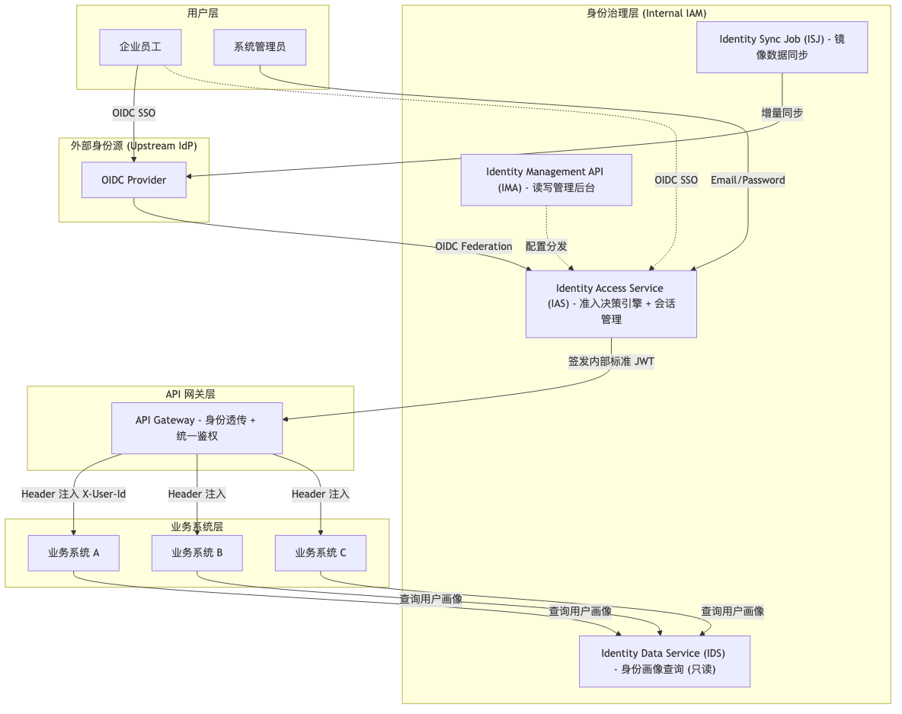
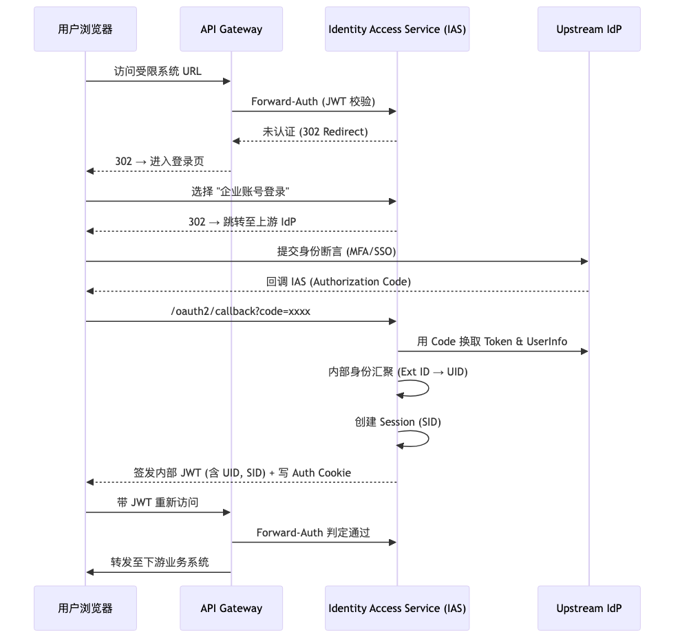
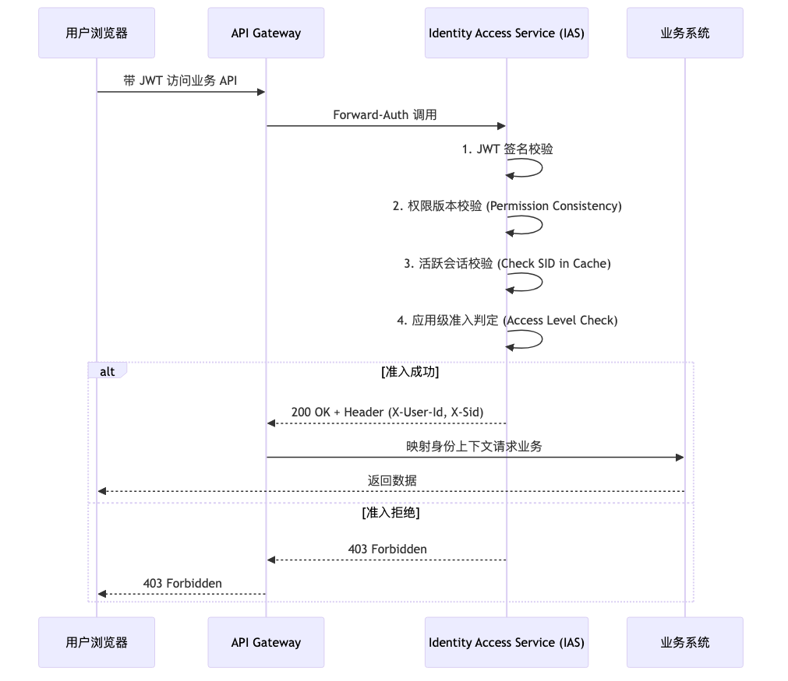

在企业环境里，经常遇到这样的场景：OA、CRM、项目管理、财务等十几套业务系统并行运行，每个系统都有自己的用户体系、权限模型、登录方式。新员工入职时，IT 要在所有系统里逐个创建账号，设置权限；员工离职时，又要逐个停用权限；某天要调整某个应用的准入策略，却发现改动点分散在各个业务系统里。

**这背后是三个核心问题：**

- **准入逻辑分散**：各业务系统独立实现准入控制，策略变更导致多点重构
- **身份标识不一**：不同服务对同一用户的标识规则（Email、Subject ID）冲突，数据难以打通
- **属性管理重复**：组织架构在多处维护，缺乏单一事实来源

成熟的身份源（OIDC Provider）主要负责解决"这人是谁"的身份断言，但企业内部的"这人能进哪些系统、能做什么事"的准入决策，还需要一层统一的身份治理体系。

**下面分享一个基于标准 OAuth2/OIDC 协议的身份中继架构**，在不绑定特定厂商的前提下，实现跨系统的统一准入决策与身份画像汇聚。

<!-- more -->

## 架构核心原则

先说结论：**上游身份提供商（Upstream IdP）负责身份真实性，内部身份系统负责准入判定与属性分发。**

如果让业务系统直接对接外部 IdP，每个系统都要实现一遍 OAuth2 客户端、维护自己的用户映射。反之，如果让内部身份系统试图取代 IdP 的全部职责，又会丢失外部 IdP 在 MFA、SSO、生命周期管理上的成熟能力。

因此，在中间加一层**身份中继层（Identity Relay Layer）**：



## 两个关键交互流

### A. 联合登录流程

用户点击"企业账号登录"后的完整流程：



**这里的关键点是"身份汇聚"**：无论用户来自哪个 OIDC Provider 还是本地邮箱密码登录，最终都映射到一个全局唯一的 `UID`，业务系统看到的一直是这个 `UID`，不关心上游身份源的变化。

### B. 透明鉴权与准入流

用户已经拿到 JWT 后，每次访问业务 API 时的鉴权流程：



**这四步校验分别解决：**

1. **JWT 完整性**：防止 Token 被篡改
2. **权限版本**：管理员修改准入策略后，版本号递增，所有旧 Token 立即失效
3. **SID 会话校验**：支持即时撤回权限（踢人、强制下线）
4. **应用级准入**：在业务逻辑之前做一道统一拦截

## 关键设计决策

### 决策 1：准入控制 vs 业务权限的边界

这是最容易混淆的地方。先说清楚：

- **准入控制（Access Control）**：由身份系统决定该用户是否有权**进入**此应用
- **功能权限（Feature Permission）**：应用内部通过 IAM 提供的属性自行判定该用户能**做什么**

**为什么这样划分？**

如果把所有权限逻辑都放进身份系统，很快就会出现"中央身份系统过度侵入业务细节"的问题。反之，如果让业务系统自己管理准入，又会回到"每个系统都要实现一遍用户管理"的起点。

所以，这里的平衡点是：**身份系统作为 Attribute Provider（属性提供者），业务系统作为 Rule Definer（规则定义者）**。

### 决策 2：为什么选 Spring Authorization Server？

对比了几个方案后，最终选了 Spring Authorization Server 作为 IAS 核心：

| 方案 | 优势 | 不足 |
|------|------|------|
| **Keycloak** | 开箱即用、功能完整 | 定制化困难，侵入性强 |
| **Spring Authorization Server** | 纯净的 OAuth2 实现、灵活扩展 | 需要自己组装模块 |
| **Auth0** | SaaS 服务、运维简单 | 绑定厂商、数据出境风险 |

**Spring Authorization Server 的最大优势**：它的纯净 OAuth2 实现支持将任何第三方 Identity Provider 抽象为"身份源"，便于插入自定义的"准入决策链"。

### 决策 3：无状态与有状态的平衡 (SID 设计)

OAuth2 协议本身是无状态的，JWT 的 `exp` 字段决定了 Token 什么时候自然过期。但在生产环境里，还需要支持：

- 用户主动退出后，旧 Token 立即失效
- 管理员踢出某个会话
- 密码修改后强制旧会话下线
- 同浏览器多标签页共享一套失效状态

**解决方案**：在 JWT 中嵌入 Session ID (SID)，由后端 Redis 集群维护。

```javascript
// 签发 Token 时，把 SID 一起写入 claim
const sid = randomSessionId();
await redis.set(`session:sid:${sid}`, "1", { EX: 43200 });

const accessToken = signJwt({
  sub: userId,
  sid,
  exp: now + 900
});

// 校验 Token 时，同时检查 SID 是否还存在
async function validateAccessToken(token) {
  const payload = verifyJwt(token);
  const exists = await redis.exists(`session:sid:${payload.sid}`);

  if (!exists) {
    throw new Error("session revoked");
  }

  return payload;
}

// logout 或踢人时，删除 SID
async function revokeSession(sid) {
  await redis.del(`session:sid:${sid}`);
}
```

**这个做法的重点不在 Redis 本身，而在于给"主动撤销"加了一个服务端抓手**。只靠 JWT 的 `exp`，系统通常只能等它自然过期。

### 决策 4：权限即时生效的版本一致性

如果管理员修改了某个应用的准入策略，希望变更能"分钟级生效"，而不是等所有 Token 自然过期（可能要等几十分钟到几小时）。

**解决方案**：用户与权限的映射持有 `permission_version`，网关准入时进行版本匹配校验。

流程：
1. 管理员修改准入策略，版本号递增 (v1 → v2)
2. 所有活跃 Token (v1) 在下次请求时，版本不匹配
3. 网关拒绝访问，前端触发重新鉴权
4. 重新鉴权后获取新 Token (v2)

这样就能在不牺牲 JWT 无状态优势的前提下，实现权限变更的快速生效。

## 身份汇聚：UID 驱动的统一画像

架构通过"身份联合转换"将异构账户标识转换为全局唯一的 `UID`：

```
┌──────────────────────────────────────┐
│            身份联合映射关系               │
├──────────┬─────────────┬─────────────┤
│  UID     │ External ID │ Identity Type│
├──────────┼─────────────┼─────────────┤
│    100   │ aaa111bbb.. │ OIDC_SUB/OID │  ← 主力联合身份
│    100   │ user@domain │ EMAIL_PWD    │  ← 容灾/备用身份
└──────────┴─────────────┴─────────────┘
```

**设计的核心在于实现 IDP-Agnostic（身份源无关）**，确保上游账号的变更（如企业更名导致的 Email 域名变更）不会影响业务系统中的数据关联。

举个例子：

- 用户在公司 A 时期，用 `user@company-a.com` 注册，UID=100
- 公司收购后更名为公司 B，Email 域名变为 `user@company-b.com`
- 但在业务系统里，这个用户的所有数据仍然关联到 UID=100
- 无需迁移数据，只需在联合映射表里增加一条新的映射记录

## 协作边界规范

通过标准化协议明确身份治理系统与上游 IdP 的协作：

| 职责方 | 负责的核心能力 |
|------|------|
| **上游 IdP** | 身份断言 (Assertion)、MFA/SSO、生命周期同步 (HR 系统集成) |
| **内部治理层** | 准入决策、会话一致性管理、企业画像补全、全局操作审计 |

上游 IdP 专注于"这人是谁"，内部治理层专注于"这人能干什么"，职责清晰，不会互相干扰。

## 小结

回顾一下这套架构做了什么：

1. **协议中立**：基于标准 OAuth2/OIDC，不绑定特定供应商，可对接任意 OIDC Provider
2. **治理一致**：通过网关注入实现身份的全局可信分发，业务系统无需重复实现用户管理
3. **管理可控**：通过 SID 和版本机制，将无状态协议的灵活性与有状态管理的安全性结合

**延伸阅读**：

- [RFC 6749: The OAuth 2.0 Authorization Framework](https://datatracker.ietf.org/doc/html/rfc6749)
- [OpenID Connect Core 1.0](https://openid.net/specs/openid-connect-core-1_0.html)
- [RFC 9700: Best Current Practice for OAuth 2.0 Security](https://datatracker.ietf.org/doc/html/rfc9700)
